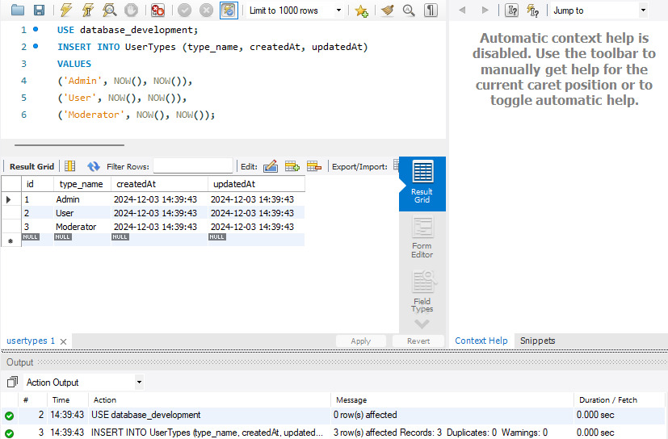
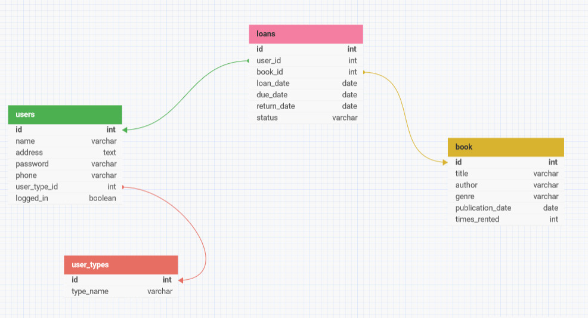
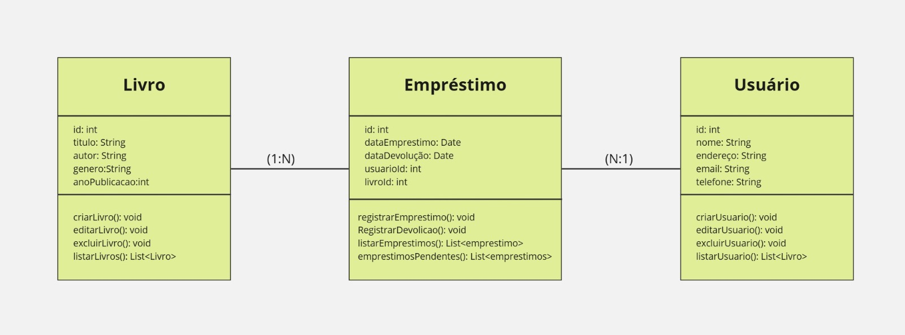
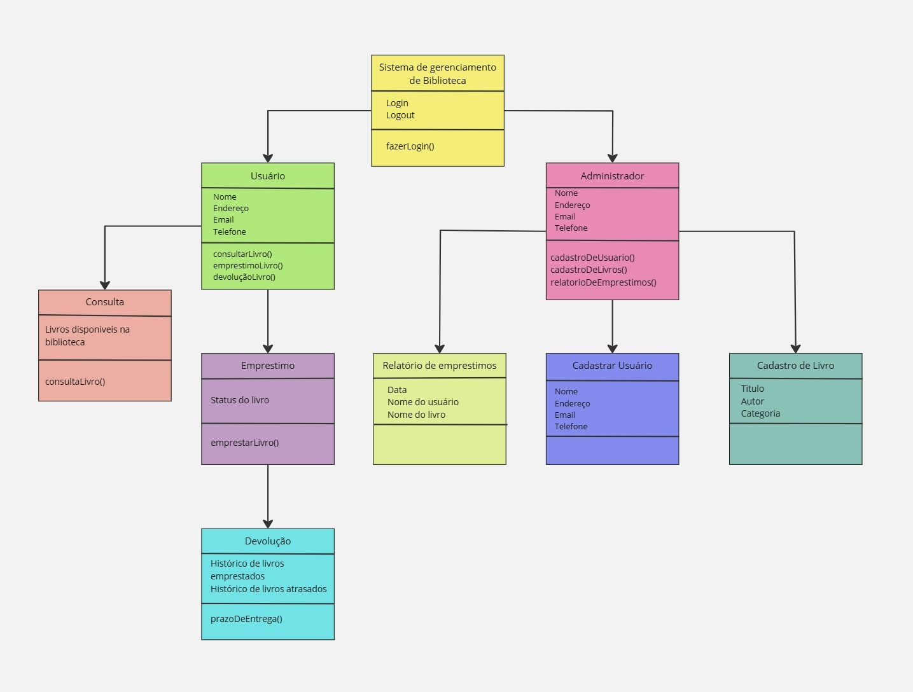
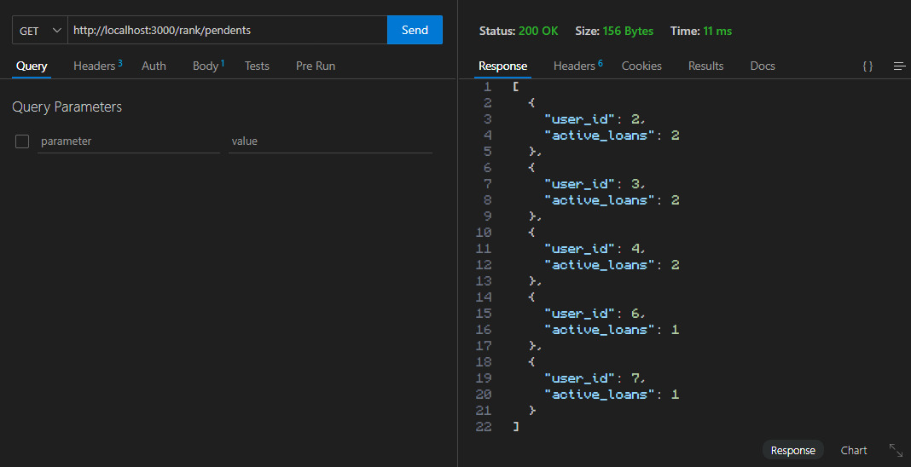
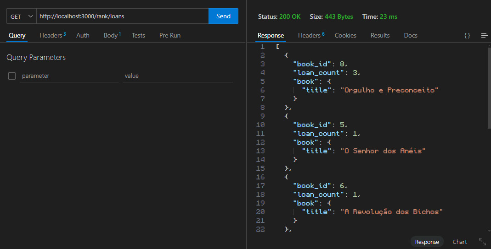

# Sistema de Gerenciamento de Livraria

> Um sistema simples para gerenciar livros, usuários e empréstimos em uma livraria, desenvolvido utilizando Sequelize, MySQL e NodeJS com Express.

---

## Descrição do Projeto

Este projeto foi criado para gerenciar uma livraria, oferecendo funcionalidades como:

- Gerenciamento de usuários (CRUD);
- Gerenciamento de livros (CRUD);
- Registro e controle de empréstimos;
- Validação de número máximo de empréstimos por usuário (3 ativos);
- Listagem de livros mais emprestados.

O backend foi implementado em **Node.js**, utilizando o **Sequelize** para ORM (Object-Relational Mapping) e **MySQL** como banco de dados.

---

## Como Baixar o Repositório

Siga os passos abaixo para clonar e configurar o projeto localmente:

Clone o repositório para sua máquina local
```bash
   git clone https://github.com/brennoaf/libraryapi.git
```

Acesse o diretório do projeto
```bash
   cd libraryapi
```

Instale as dependências
```bash
   npm install
```

Configure o seu banco em src/config/config.json
Por exemplo:
```bash
   "test": {
      "username": "root",
      "password": null,
      "database": "database_test",
      "host": "127.0.0.1",
      "dialect": "mysql"
   }
```

Rode as migrações para criar as tabelas no banco de dados
```bash
   npx sequelize-cli db:migrate
```

Execute o projeto
```bash
   npm start
```

---

## Dica:
Insira os tipos de usuário na tabela usertypes para inserir os tipos de usuário e seus cargos conforme o exemplo:



## Contribuindo

Contribuições são bem-vindas!  
Siga estas etapas para contribuir com o projeto:

1. Faça um fork do repositório.
2. Crie uma branch para sua nova funcionalidade ou correção:
   ```bash
   git checkout -b minha-nova-feature
   ```
3. Faça suas alterações e commit:
   ```bash
   git commit -m "Descrição clara da alteração"
   ```
4. Envie suas alterações:
   ```bash
   git push origin minha-nova-feature
   ```
5. Abra um Pull Request no GitHub.

Para mais detalhes, veja o arquivo [`CONTRIBUTING.md`](./CONTRIBUTING.md).

---

## Licença

Este projeto está licenciado sob a licença [Creative Commons](./LICENSE).

---

## Imagens

### 1. Diagrama ER


### 2. Diagrama UML


### 3. Diagrama de fluxo


### 4. Consultando usuários ainda devendo


### 5. Consultando livros mais alugados


